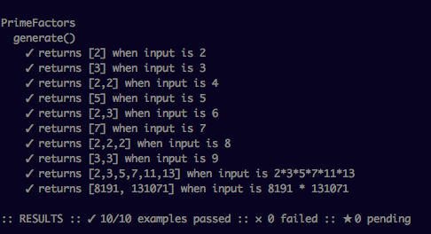

#prime-factors-kata
A code kata is an exercise in programming which helps a programmer hone their skills through practice and repetition. The term was probably first coined by Dave Thomas, co-author of the book The Pragmatic Programmer, in a bow to the Japanese concept of kata in the martial arts.

This coding Kata in Swift finds prime factors of a given number. It is inspired by Robert Martin aka Uncle Bob's [Prime Factor Kata](http://butunclebob.com/ArticleS.UncleBob.ThePrimeFactorsKata). 

## Development

The aim behind writing this program was to get familiar with the basics of Swift while getting used to its Static typed style (in contrast to dynamically typed ruby). Further, I wanted to get started with Test Driven Development in Swift and this was a good way to do it.  

## Installation and Usage

This requires Swift 3.0 to run which is still not officially released. Therefore, we will use a tool called `Docker` to run it easily and effectively.

1. Download Docker [here](https://www.docker.com/).
2. Intall and run Docker.

After completing the above two steps, use your terminal to go inside the prime-factors-kata directory (by using `cd` command). Now, simply run the following command through the terminal:

```
$ docker run -w /app -v $PWD:/app swiftdocker/swift:snapshot-2016-05-31-a make
```

## Output

The output should look something like the following:


 
